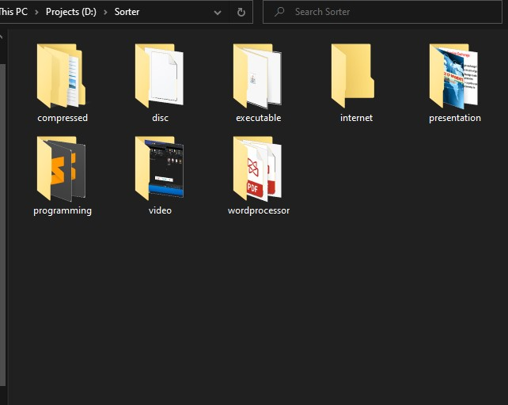

# autoSORT

## Contents
* [General info](#general-info)
* [Screenshots](#screenshots)
* [Technologies](#technologies)
* [Setup](#setup)
* [Features](#features)
* [Status](#status)
* [Inspiration](#inspiration)
* [Contact](#contact)

## General info

This project serves the purpose of sorting huge chunks of files according to their extensions by just a simple drag and drop operation

## Screenshots

Sorted files in their respective genre folders

## Technologies
Project is created with:
* Python 3.8.3 
* Beautiful Soup 4.9.0 
* Pandas 1.0.4

## Setup
Work in progress...

## Features
#### Features that are functional :sob:
* Sort files according to genre
* Over 140+ file extensions supported
* Ability to leave it running indefinitely - new files will be sorted when detected by script
#### Work in Progress :crying:
* Customise your genre
* Add your own file extensions
#### My wishlist for the future
* Add GUI element
* Interactive app

## Status
Project is: in progress 

## Inspiration 
[Automate the Boring Stuff Book](https://automatetheboringstuff.com/) 
* The topic about os & file handling inspired me to automate the fussy job of sorting a myraid of files which can be time consuming. Why not run it in the background and let the script sort it out for you? :grin:

## Contact
Created by [@HCTANG](https://github.com/thchong-code) - feel free to contact me!
